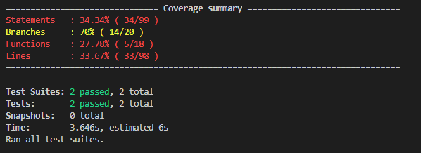
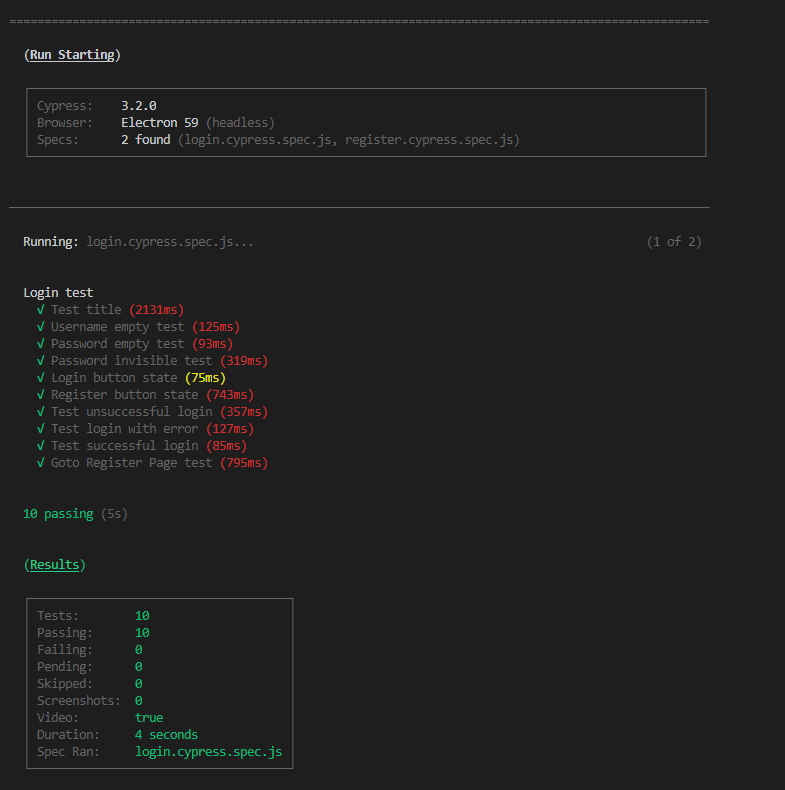
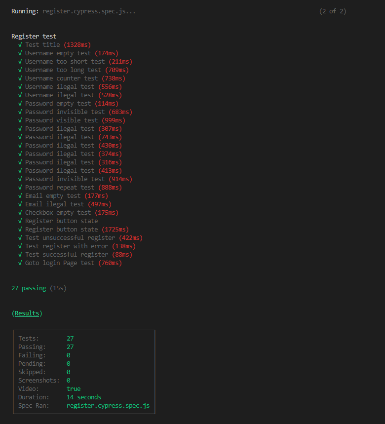
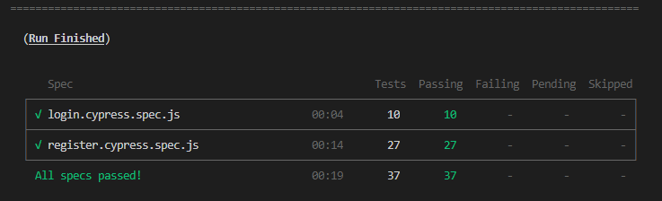

# Lab4 Agileffy的测试

小组成员:胡志峰、杨俊逸、蔡彦麓、赵伟承、吴钟立

[TOC]

## 测试与持续集成

Agileffy开发小组为了合作开发的便利性，使用了GitHub[^1]作为代码协作环境，使用git作为版本控制软件。我们的开发小组的主页为[Agileffy Development Foundation](<https://github.com/agileffy>)，前端代码仓库为[Agileffy](https://github.com/agileffy/Agileffy)，后端代码仓库为[AgileffyServer](https://github.com/agileffy/AgileffyServer)，最新的发行版本可以通过[agileffy.github.io](https://agileffy.github.io/)访问。

在本Lab中我们对于Agileffy项目已经开发完成的的部分进行了系统性的集成测试，注意到虽然我们现在才描述Agileffy的测试，但实际上在项目的一开始我们就留意到了测试对于多人合作的复杂软件开发过程的重要性，因此一开始就构建了鲁棒的测试框架，并持续使用到现在。

因为开发过程由多人共同完成代码，测试在这个过程中显得尤为重要，因为我们需要在开发中避免合并代码引入漏洞。如果在开发过程中没有有效的测试，在整个项目完成之后将无法有效地找到漏洞所在，也无法对引入漏洞的提交进行追责。

而引入测试则不可避免地需要我们构建一套方便的工作流程（workflow），因此自动化的持续集成是必要的。我们使用了travis[^2]提供的服务为我们的代码仓库构建了持续集成的支持，对于任何pull request到主分支的代码进行构建和测试，只有在通过构建和测试后才允许合并到主分支中。同时为了保证提交的代码质量，我们额外也使用了代码风格和错误的检测工具（eslint, tslint, pylint），并且通过配置文件规定了统一的代码风格。

我们采用的工作流程如下

1. 开发者（小组成员）pull主代码库，并新建分支`用户名/dev`，在该分支下进行开发
2. 完成增量开发，commit文件变化，push到GitHub上host的代码仓库，并提起Pull Request
3. 在Pull Request的分支上自动化运行持续集成，通过构建和所有的测试用例后允许Merge
4. 通过GitHub提供的Branch Protection，我们要求至少有另外一个开发者完成代码审核才能Merge
5. Merge代码到主分支上，travis自动构建并部署到[agileffy.github.io](https://agileffy.github.io)

实践中我们十足地受益于该工作流程，具体可以参加我们的[commit历史记录](<https://github.com/agileffy/Agileffy/commits/master>)。

## 前端测试

前端我们采用的技术栈为 Vue+Vuetify+Typescript ，我们分别对前端进行单元测试（针对TypeScript语言文件，以白盒为主）和端到端测试（针对Vue文件，以黑盒为主）。

### 单元测试（Unit Test）

单元测试采用Jest框架和Mocha+Chai断言库进行编写对于ts文件进行测试，并且在Jest框架下进行测试覆盖率检测。

#### Time 模块的单元测试

对于Time模块的测试，由于Time模块本质上是四个平行的分支结构，因此我们只需要相应的设置对应的测试样例即可，因此既是最大覆盖也是最小覆盖测试。

| 测试输入 | 期望输出 |
|---------|---------|
| 今日6：00：00 | 6：00：00 |
| 昨日6：00：00 | 昨天 6：00：00 |
| 一周内某天6：00：00 （假设周六） | 星期六 6：00：00 |
| 超过一周某天6：00：00 （假设1970-01-01） | 1970-01-01 6：00：00 |

### 端到端测试（E2E, End to End Testing）

端到端测试采用了Cypress作为基础框架，针对不同页面编写端到端测试，通过模拟用户输入，测试软件是否给出了符合要求的结果。测试过程可见以下两个视频文件：

[LOGIN 测试](imgs/login.cypress.spec.js.mp4)

[REGISTER 测试](imgs/register.cypress.spec.js.mp4)

#### Login 页面的端到端测试

首先是针对表单的测试，由于表单都是必填项，因此我们对这些表单进行测试。同时我们需要测试在表单无效时，登录按钮是否可以点击。最后我们使用Cypress启动一个虚假的服务器后台并劫持来自前端的请求，并且返回可能的各种response（包括正常的OK response，正常的验证失败response和404等错误response），然后测试页面对于response的反应是否符合预期。另外，我们还对页面上的链接是否正确的进行了跳转进行了测试。

#### Register 页面的端到端测试

与Login测试类似，不过测试的重点在于表单项。对于一个表单项，我们分别针对其的require，最短，最长和正则表达式验证以最小覆盖的方法进行测试（用户名，密码，邮箱信息）。同时我们还额外针对密码输入区域的文字可见性，密码再次输入的一致性验证等逐一进行了测试。

## 后端测试

[^1]: <https://github.com/>
[^2]:<https://github.com/apps/travis-ci>

