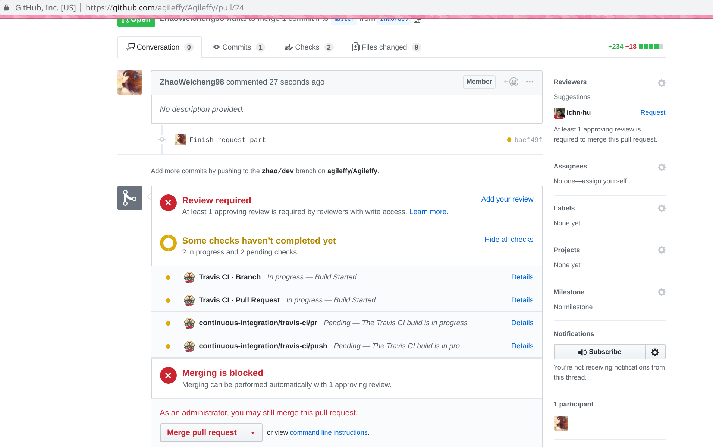

# Lab4 Agileffy的测试

小组成员:胡志峰、杨俊逸、蔡彦麓、赵伟承、吴钟立

[TOC]

## 测试与持续集成

Agileffy开发小组为了合作开发的便利性，使用了GitHub[^1]作为代码协作环境，使用git作为版本控制软件。我们的开发小组的主页为[Agileffy Development Foundation](<https://github.com/agileffy>)，前端代码仓库为[Agileffy](https://github.com/agileffy/Agileffy)，后端代码仓库为[AgileffyServer](https://github.com/agileffy/AgileffyServer)，最新的发行版本可以通过[agileffy.github.io](https://agileffy.github.io/)访问。

在本Lab中我们对于Agileffy项目已经开发完成的的部分进行了系统性的集成测试，注意到虽然我们现在才描述Agileffy的测试，但实际上在项目的一开始我们就留意到了测试对于多人合作的复杂软件开发过程的重要性，因此一开始就构建了鲁棒的测试框架，并持续使用到现在。

因为开发过程由多人共同完成代码，测试在这个过程中显得尤为重要，因为我们需要在开发中避免合并代码引入漏洞。如果在开发过程中没有有效的测试，在整个项目完成之后将无法有效地找到漏洞所在，也无法对引入漏洞的提交进行追责。

而引入测试则不可避免地需要我们构建一套方便的工作流程（workflow），因此自动化的持续集成是必要的。我们使用了travis[^2]提供的服务为我们的代码仓库构建了持续集成的支持，对于任何pull request到主分支的代码进行构建和测试，只有在通过构建和测试后才允许合并到主分支中。同时为了保证提交的代码质量，我们额外也使用了代码风格和错误的检测工具（eslint, tslint, pylint），并且通过配置文件规定了统一的代码风格。

我们采用的工作流程如下

1. 开发者（小组成员）pull主代码库，并新建分支`用户名/dev`，在该分支下进行开发
2. 完成增量开发，commit文件变化，push到GitHub上host的代码仓库，并提起Pull Request
3. 在Pull Request的分支上自动化运行持续集成，通过构建和所有的测试用例后允许Merge
4. 通过GitHub提供的Branch Protection，我们要求至少有另外一个开发者完成代码审核才能Merge
5. Merge代码到主分支上，travis自动构建并部署到[agileffy.github.io](https://agileffy.github.io)

实践中我们十足地受益于该工作流程，具体可以参加我们的[commit历史记录](<https://github.com/agileffy/Agileffy/commits/master>)。

## 前端测试

前端我们采用的技术栈为 Vue+Vuetify+Typescript ，我们分别对

### 单元测试（Unit Test）

### 端到端测试（E2E, End to End Testing）

## 后端测试

[^1]: <https://github.com/>
[^2]:<https://github.com/apps/travis-ci>

