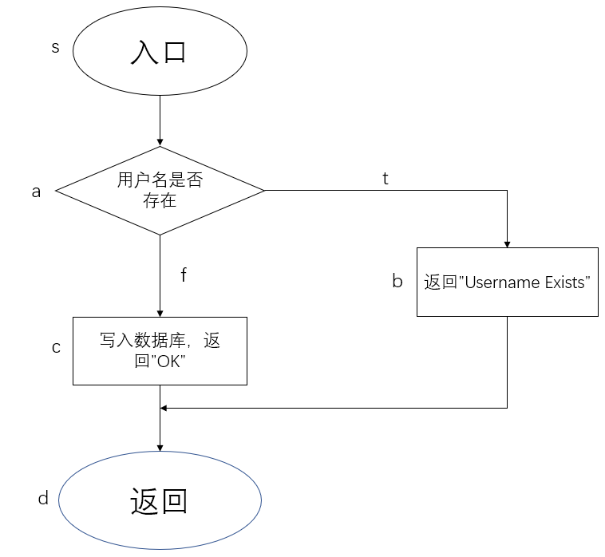
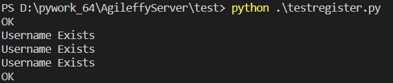
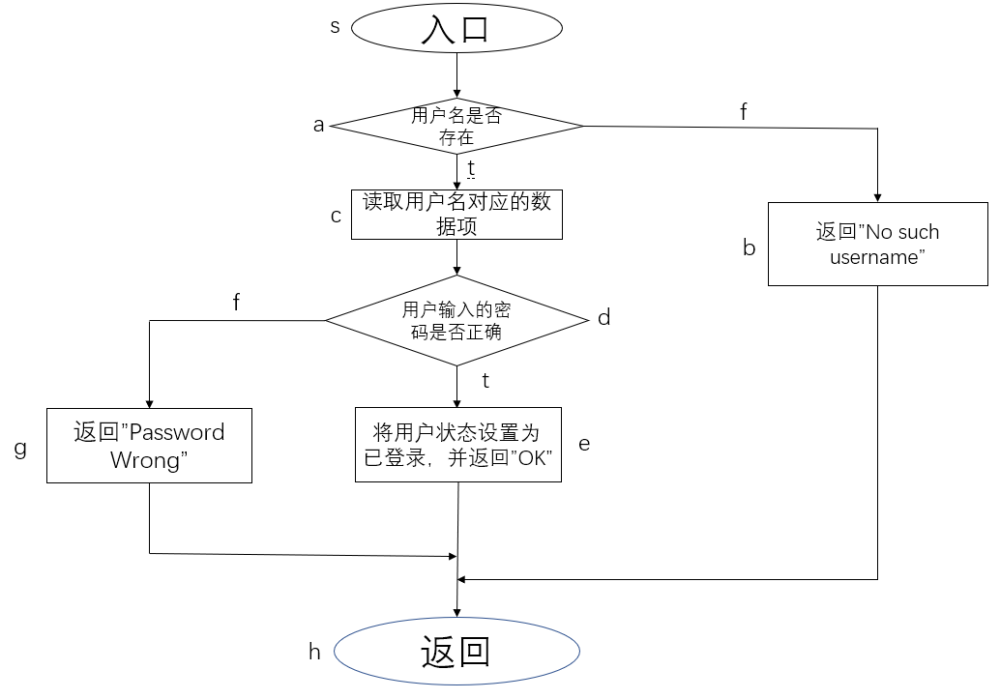
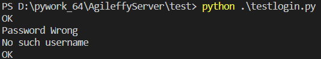

# Agileffy的测试


## 测试与持续集成

## 前端测试

## 后端测试
后端测试以白盒测试为主，本次针对注册和登录两个功能模块进行测试。
### 注册模块
#### 逻辑

注册模块代码详见[此链接](https://github.com/agileffy/AgileffyServer/blob/master/src/register.py>)

注册模块接受来自前端的用户注册信息，包括用户名、密码、邮箱；其合法性由前端保证。后端的注册模块只检查用户名是否已存在，若用户名不存在则将用户注册信息写入数据库，若写入成功则返回"OK"信息，写入失败则返回"An Error occured on the server"信息；若用户名已存在则返回"Username Exists"信息。
#### 测试

除了写入新用户信息失败的分支(该分支无法直接通过测试样例到达)，测试实现了判定——条件覆盖。在数据库为空时传入一条注册信息以进入注册成功分支，再传入一条相同的注册信息以进入用户名已存在的分支，再传入密码/邮箱改变而用户名不变的注册信息验证用户名已存在的分支只对用户名有效，再传入一条用户名不同的注册信息以再次验证注册成功分支，检查其输出。路径示意图、测试用例表以及测试代码如下：



| 测试数据                                                     | 预期结果          | 路径 |      |      | 覆盖的条件     |
| ------------------------------------------------------------ | ----------------- | ---- | ---- | ---- | -------------- |
| 'username':'rebel',<br/>'password':'123456',<br/>'email' : 'cylnb@cylnb.com' | "OK"              | sacd |      |      | 用户名尚未存在 |
| 'username':'rebel',<br/>'password':'123456',<br/>'email' : 'cylnb@cylnb.com' | "Username Exists" | sabd |      |      | 用户名已存在   |
| 'username':'rebel_',<br/>'password':'123456',<br/>'email' : 'cylnb@cylnb.com' | "OK"              | sacd |      |      | 用户名尚未存在 |

```python
import requests

url = 'http://127.0.0.1:5000/register'
d = {'username':'rebel',
        'password':'123456',
        'email' : 'cylnb@cylnb.com'}

r = requests.post(url, data=d)
print(r.text)

d = {'username':'rebel',
        'password':'123456',
        'email' : 'cylnb@cylnb.com'}

r = requests.post(url, data=d)
print(r.text)

d = {'username':'rebel',
        'password':'654321',
        'email' : 'cylnb@cylnb.com'}

r = requests.post(url, data=d)
print(r.text)

d = {'username':'rebel',
        'password':'123456',
        'email' : 'rebel@cylnb.com'}

r = requests.post(url, data=d)
print(r.text)

d = {'username':'rebel_',
        'password':'123456',
        'email' : 'cylnb@cylnb.com'}

r = requests.post(url, data=d)
print(r.text)
```

测试结果如下：



测试结果符合预期。

### 登录模块

#### 逻辑

登录模块代码详见[此链接](https://github.com/agileffy/AgileffyServer/blob/master/src/login.py)

登录模块接受用户的登录请求，然后检查数据库中是否存在用户名对应的数据项，若不存在相应的数据项，则返回"No such username"信息；否则找到相应的数据项，并将数据库中存储的用户密码与输入的密码进行比较，若密码一致，则将用户的状态设置为已登录，并返回"OK"信息；否则返回"Password Wrong"信息。

#### 测试

测试实现了判定——条件覆盖。基于上一步已写入数据库的两条记录，先后输入：正确的用户名和密码以进入登陆成功分支、正确的用户名和错误的密码以进入用户名存在而密码错误的分支、不存在的用户名和密码以进入用户名不存在分支，以及另一条记录的正确的用户名和密码以再次验证登陆成功分支，检查其输出。路径示意图、测试用例表以及测试代码如下：



| 测试数据                                 | 预期结果           | 路径   |      |      | 覆盖的条件             |
| ---------------------------------------- | ------------------ | ------ | ---- | ---- | ---------------------- |
| 'username':'rebel', 'password':'123456'  | "OK"               | sacdeh |      |      | 用户名存在且密码正确   |
| 'username':'rebel', 'password':'654321'  | "Password Wrong"   | sacdgh |      |      | 用户名存在且密码不正确 |
| 'username':'rebel0', 'password':'123456' | "No Such username" | sabh   |      |      | 用户名不存在           |

```python
import requests

url = 'http://127.0.0.1:5000/login'
d = {'username':'rebel', 'password':'123456'}

r = requests.post(url, data=d)
print(r.text)

d = {'username':'rebel', 'password':'654321'}

r = requests.post(url, data=d)
print(r.text)

d = {'username':'rebel0', 'password':'123456'}

r = requests.post(url, data=d)
print(r.text)

d = {'username':'rebel_', 'password':'123456'}

r = requests.post(url, data=d)
print(r.text)
```

测试结果如下：



测试结果符合预期。